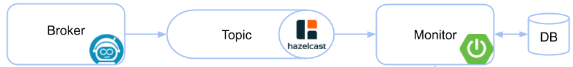
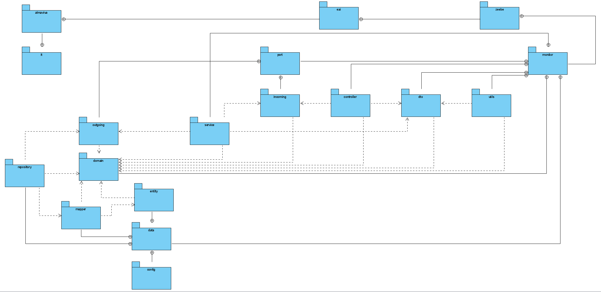

Zeebe Monitor
==========================

A monitoring application for [Zeebe](https://zeebe.io). It is designed for developers to

* get in touch with Zeebe and workflow execution (BPMN)
* test workflows manually
* provide insides how workflows are executed 

The application imports the data from Zeebe using the [Hazelcast exporter](https://github.com/zeebe-io/zeebe-hazelcast-exporter). It aggregates the data and store it into a database.



## Component diagram


## Package diagram


## Install
### Docker
The docker image for the worker is published to [Nexus Giottolabs](https://repo.eai.giottolabs.com)

```
docker pull docker.eai.giottolabs.com/zeebe-monitor-be:0.26.0
docker run -d --name zeebemonitor -p 8080:8080 docker.eai.giottolabs.com/zeebe-monitor-be:0.26.0
```


* ensure that a Zeebe broker is running with a Hazelcast exporter (>= 0.8.0-alpha1)
* forward the Hazelcast port to the docker container (default: 5701)
* configure the connection to the Zeebe broker by setting `zeebe.client.broker.contactPoint` (default: `localhost:26500`) 
* configure the connection to Hazelcast by setting `zeebe.client.worker.hazelcast.connection` (default: `localhost:5701`)


### Configuration

The application is a Spring Boot application that uses the [Spring Zeebe Starter](https://github.com/zeebe-io/spring-zeebe). The configuration can be changed via environment variables or an `application.yaml` file. See also the following resources:
* [Spring Zeebe Configuration](https://github.com/zeebe-io/spring-zeebe#configuring-zeebe-connection)
* [Spring Boot Configuration](https://docs.spring.io/spring-boot/docs/current/reference/html/spring-boot-features.html#boot-features-external-config)

By default, the port is set to `8080` and the datasource is **postgres**.

```
zeebe:

  client:
    broker.contactPoint: 127.0.0.1:26500
    security.plaintext: true
    
    worker:
      hazelcast:
        connection: localhost:5701
        connectionTimeout: PT30S

spring:

  datasource:
    platform: postgres
    url: jdbc:postgresql://localhost:5432/dbname?currentSchema=simplemonitor
    username: postgres
    password: postgres1
    driverClassName: org.postgresql.Driver
    
  autoconfigure:
    exclude: 
       org.springframework.boot.autoconfigure.mongo.MongoAutoConfiguration,
       org.springframework.boot.autoconfigure.data.mongo.MongoDataAutoConfiguration

  jpa:
    database: postgresql
    database-platform: org.hibernate.dialect.PostgreSQL9Dialect
    generate-ddl: true
    hibernate:
      ddl-auto: update

```

* ``spring.datasource`` = datasource settings
* ``spring.autoconfigure.exclude`` = disable MongoDB autoconfiguration
* ``spring.jpa.database`` = target database to operate on, auto-detected by default
* ``spring.jpa.database-platform`` = name of the target database
* ``spring.jpa.generate-ddl`` = whether to initialize the schema on startup
* ``spring.jpa.hibernate.ddl-auto`` = DDL mode. This is actually a shortcut for the "hibernate.hbm2ddl.auto" property. Defaults to "create-drop" when using an embedded database and no schema manager was detected


For datasource **mongodb** the configuration is

```
zeebe:

  client:
    broker.contactPoint: 127.0.0.1:26500
    security.plaintext: true
    
    worker:
      hazelcast:
        connection: localhost:5701
        connectionTimeout: PT30S

spring:

  data:
    mongodb: 
        database: dbname
        port: 27017
        host: localhost
    
  autoconfigure:
    exclude: 
       org.springframework.boot.autoconfigure.jdbc.DataSourceAutoConfiguration,
       org.springframework.boot.autoconfigure.orm.jpa.HibernateJpaAutoConfiguration,
       org.springframework.boot.autoconfigure.jdbc.DataSourceTransactionManagerAutoConfiguration

```

### Change Configuration Files
You can use docker volumes to link your own configuration files inside the container. For example if you want to change the **application.yaml**:
```
docker run -d --name zeebemonitor -p 8080:8080 \
           -v $PWD/application.yaml:/app/config/application.yaml \
           docker.eai.giottolabs.com/zeebe-monitor-be:0.26.0
```
